<h1 align=center> Woofme</h1>

 Are you a dog owner?   Are you a dog fan or planning to buy a dog?   Find out what people say about different breeds, find your perfect breed or share feedback on your dog's breed on our website. Woofme is a place where you can add a review and do research on other breeds!   Woofme is a place for dog lovers.   Woofme is a place for (almost) EVERYONE!

 

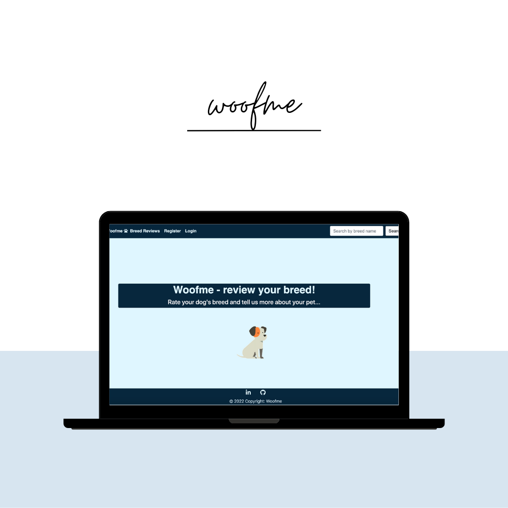

Live app link [here](https://woofmeapp.herokuapp.com/)

## User Experience

### User Stories

 As a user, I would like to be able to: 

+ Register on Woofme using username, email,  and password. 
+ Be able to view all the reviews added on Woofme.
+ Be able to view detailed reviews about different breeds.
+ Search for a breed or breed group on the navigation bar.  

 As a logged user, I would like to be able to:

+ Create breed reviews by adding:

   1. Breed name
   2. Breed Group
   3. A review of the breed
   4. Adaptability, trainability, friendliness, and health and grooming needs scores. 
   5. Overall breed rating
   6.  Breed image

  2.2 Create a new breed if a breed is not in the database.

  2.3  Edit and delete a previously added review.

  2.4 Check a breed review after being added. 

## 1. Strategy

 + **Project Goal**
  
  Create a project that allows its users to evaluate their favorite pets and read reviews on other pets' adaptability, 
  friendliness, health and grooming needs as well as trainability. 

## 2. Scope 

As a project owner, I would like to create :

* a simple, straightforward website with an intuitive UX experience.
* Clear and easy navigation for the user through each of Woofme's features.
* a visually appealing website on all devices.

## 3. Structure

* Navbar is fixed on top to facilitate Woofme users to navigate easily and pleasantly. 
* Edit, Delete, and Add review buttons present on all forms to enable users to have an intuitive and smooth experience.
* Layout is clear to allow woofme users to navigate intuitively.
* Login/Logout/Register options are present on the navbar to ensure that Woofme users can perform each of the actions easily.

## 4. Skeleton

The wireframes are created with Canva.

### 1. Add review page wireframe

### 2. Review list page wireframe

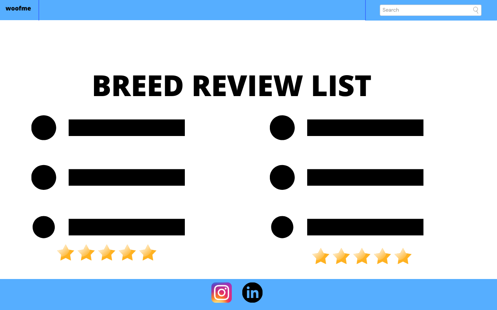

### 3. Search page wireframe(if the breed is on the database)

If the breed is not on the website, the user will get feedback and he will have access to a button that redirects to add review page so he can add the first review for the breed. 

### 4. Review page wireframe

If the user is logged in and is looking at a previously added review, he will have the option to delete or edit it. 

### 5. Login/Logout/Register pages wireframes

 + Login page:

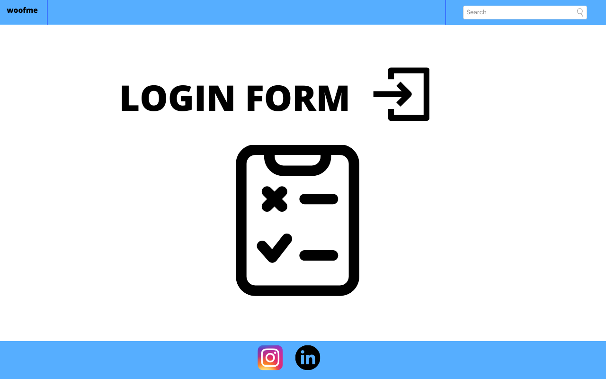

+ Register page:

## 5. Surface

* Colors

My color choice was a blue color palette which is very user-friendly and appealing. I collected it from icolorpalette.com.

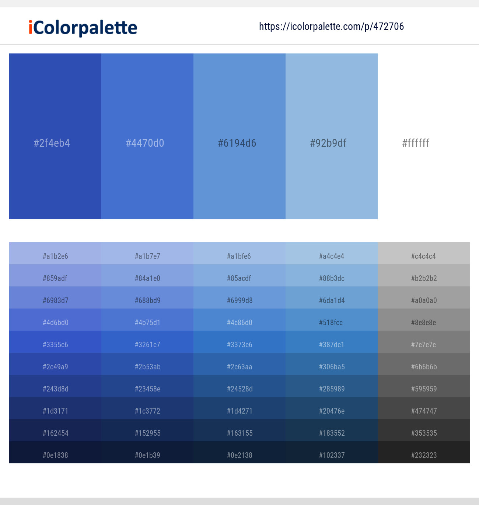

* Font selection

The font was chosen with [Google Fonts](https://fonts.google.com/) to be used across the website.

The font is chosen in 2 weights: 300 for the paragraphs and 900 for the headings.

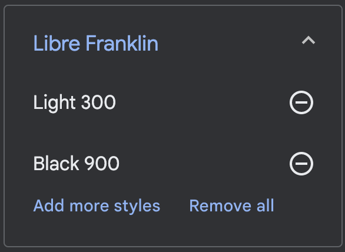

## Functional Scope 
**Woofme Flowchart**

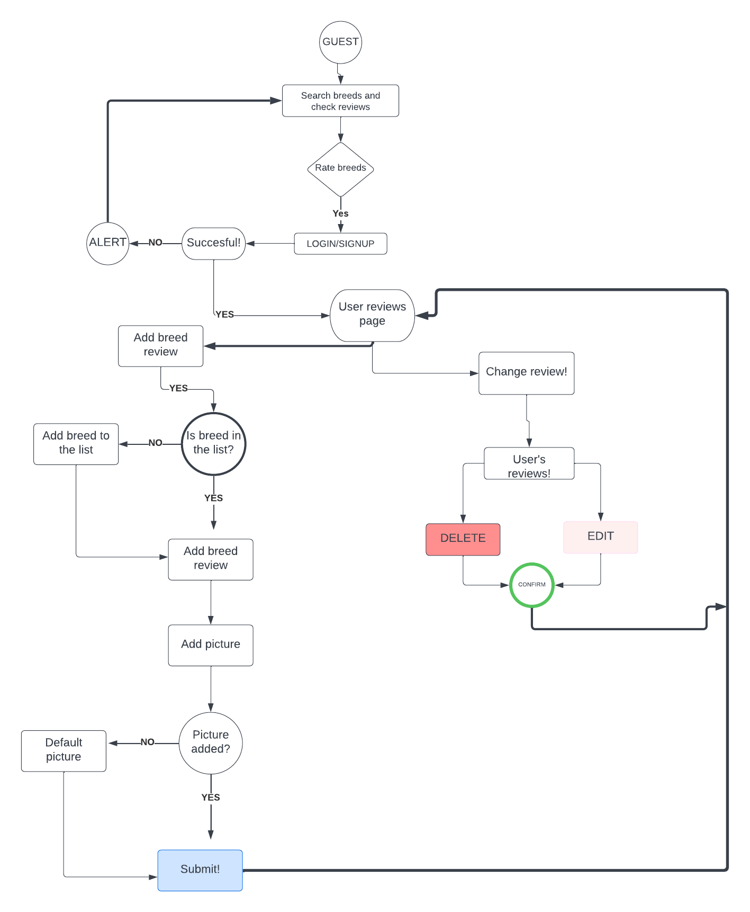

**Agile Methodology**

All functionality and development of the project were managed using the GitHub project tool and personal notes.

All sprints are described here.

Test cases were linked with every User story presented above, and can be found in TESTING.md(TESTING.md) - Automated testing section. 

* Sprint 1

  + Setup Django 
  + Heroku Deployment 
  + Create User Stories in Github

* Sprint 2
  + Create User Profile
  + Create Register Page
  + Create Login Page 
  

* Sprint 3
  + Create all models

* Sprint 4
  + Create Add Review feature 
  + Upload an image on breed review
  + Add rating breed feature

* Sprint 5

  + Create a search by breed

* Sprint 6

  + Create final tests + TESTING file
  + README file

## Features

### **Navbar** 

+ Fixed Navbar allows the user easy access to all pages. 

1. Login and  Register User buttons are present on the navbar if the user is not logged. 

* On smaller devices, the navigation bar is going to be a hamburger menu to ensure better navigation.

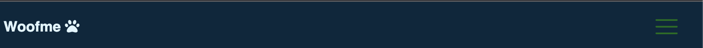

2. Logout and Rate breed buttons are present if the user is logged. 

3. Breed reviews and search breed by name/ group are present to all users (logged or not).

4. Users can use the search bar to look for a favorite breed.

    i. Find a breed by its name.

     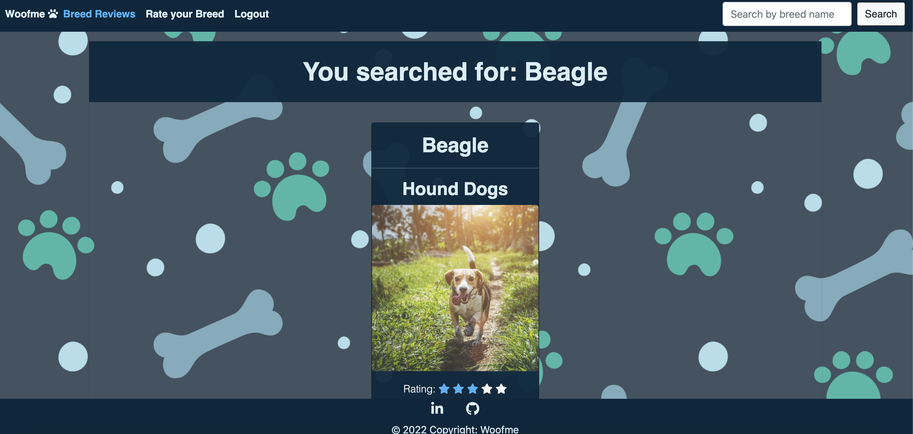

    ii. Users will get feedback if there are no reviews on the breed they are looking for and will be encouraged to rate that breed.

    iii. If the review is found, the user will be redirected to the review page to see all details on the searched breed.

### **Breed review list page**

1. Users will access a list of all reviews.

  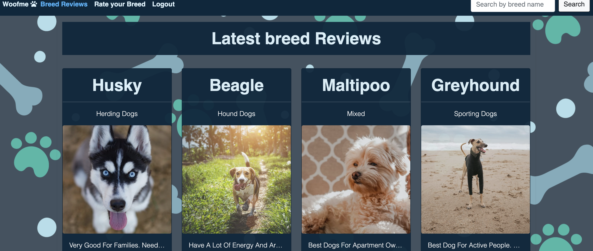

2. Each review card contains the breed name, group, image, the preview of the review, each criteria level, breed rating, author, and publication date. 

* The entire card is a link to the breed review page.

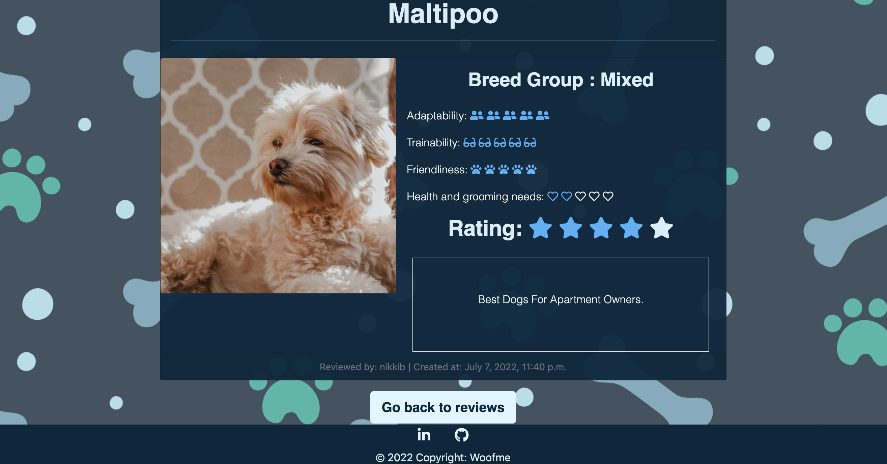

### **Breed  review  page** 

1. On this page, users can access the entire content for a review. 

  1.1 When an old user is accessing the previously created review, he will have two buttons available: edit and delete.
   
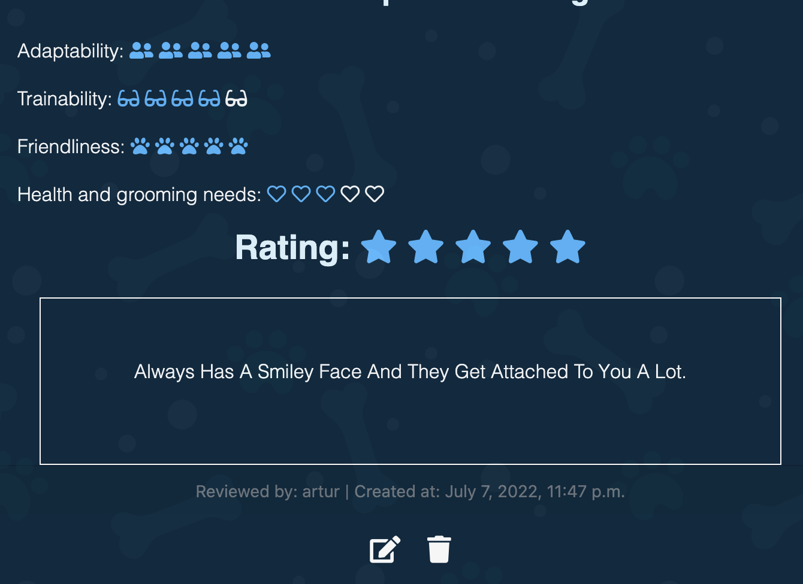

### **Edit Review Page** 

1. Users can change a review field using this page.
2. The back button will bring the user to the previous page without changes on review. 

### **Delete Review Page** 

1. When clicking on the delete button, the users will be redirected to the delete review page where they can get rid of the review.

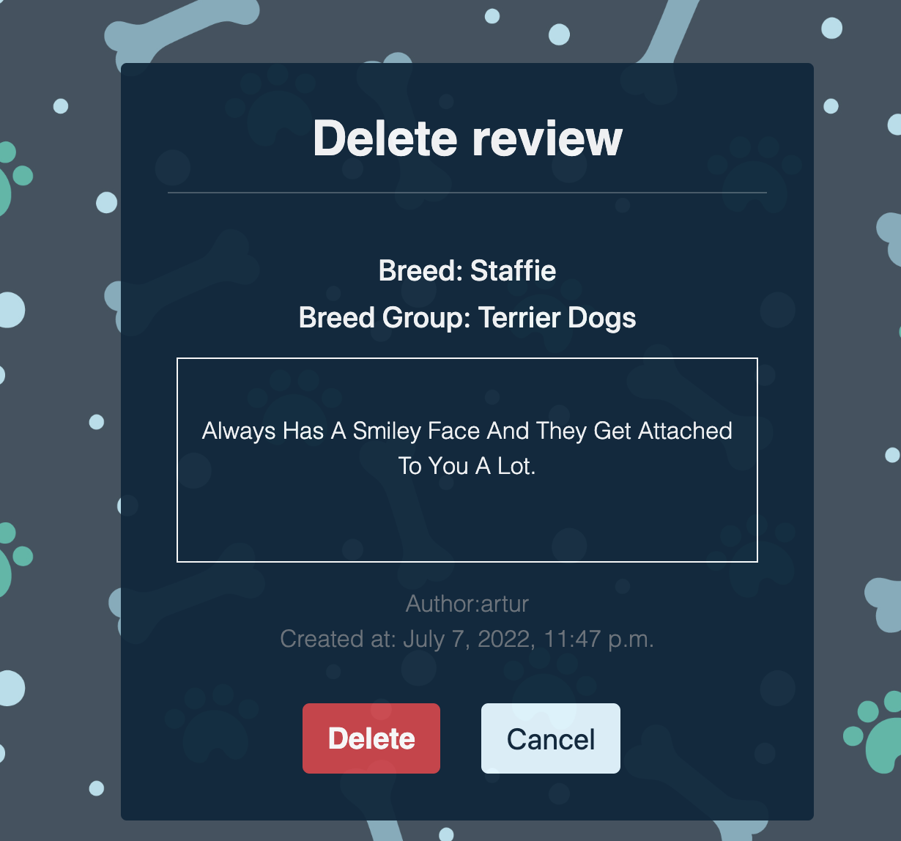

### **Search breed Page** 

1. After searching a breed using the search bar, the users will be redirected to a results page. 

2. If no review is available, users will get feedback. 

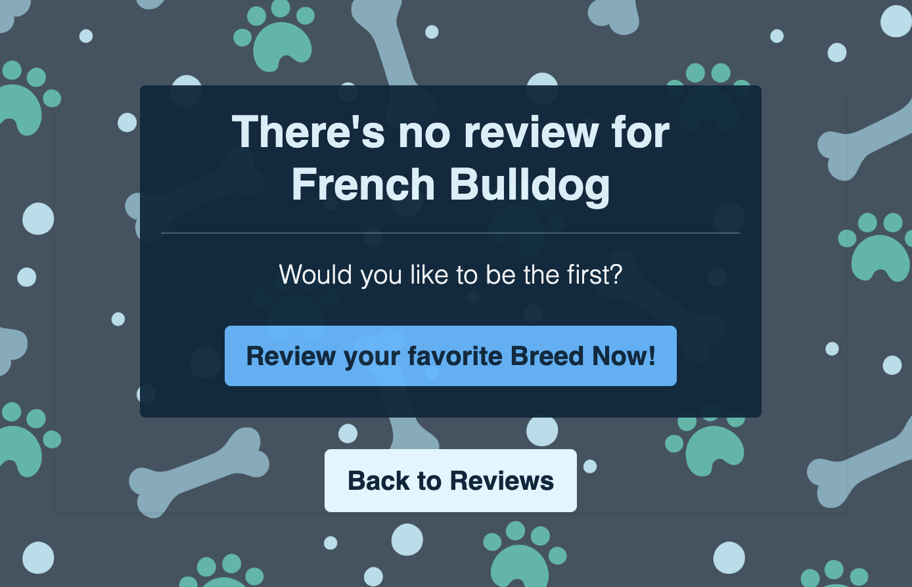

### **Login Page** 

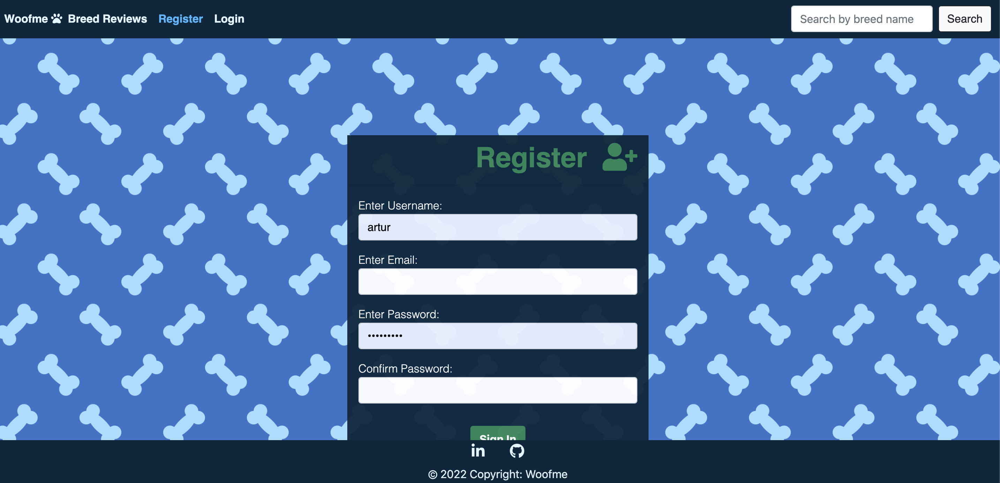

### **Register Page** 

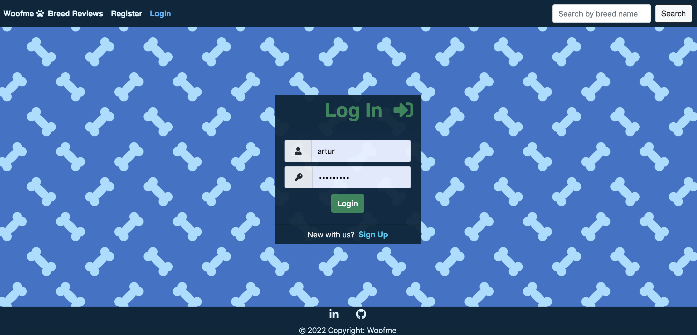

## Future Features

I would like to implement the following features: 

* Single sign-on using social media.
* Serch by breed-group using a dropdown menu.
* Add icon rating for all criteria.
* Add image for users.
* Include user profile pages with all their data on them. 

## Languages Used

Python, Javascript, CSS

## Frameworks, Libraries & Programs Used

+ CANVA: used for building wireframes.
+ FONT AWESOME: used for icons.
+ GIT: used for development.
+ GITHUB: used for user stories.
+ GOOGLE FONTS: used for font links.
+ DJANGO: main website framework.
+ PEXELS: used for all pictures.
+ getcssscan.com: used for the box-shadow on review cards. 
+ techsini.com: used to generate mockups. 
+ GRAMMARLY: to correct grammar on Testing and Readme files.

## Testing and Code validation 
All code validation and test details can be found [here](TESTING.md).

## Project Bugs and Solutions:

| Bugs              | Solutions |
| ---               | --------- |
| When deploying, the website CSS and database were failing on Heroku. | Debug Update and transfer all data to Postgres. A model did not have a slug as per old migrations.
| Rating criteria on the review page and search breed pages were not updated visually. | Typeerror on these pages (review instead of object). 
| Delete and Edit buttons were not displaying. | TypeError on delete and edit page links.
| Search breed page not working.| Old variable name for "created_at" field - TypeError.
| Toolip.js file not loading on Heroku and creating issues| Installed bootstrap js directory to the static files.

## Deployment 

This App is deployed using Heroku.

Deployment steps 

 
 1. Ensure all apps are listed on requirements.txt. 
 
Command:  ` pip3 freeze > requirements.txt`. 
 
2. Setting up your Heroku
 
  2.1 Login to Heroku and enter your details: 
  command: ` Heroku login -i` 

    
  2.2 Get your app name from Heroku.
    command: `Heroku apps`
    

  2.3 Set the Heroku remote. 
    command: `Heroku git: remote -a woofmeapp`
    

  2.4 Add, commit, and push to GitHub
    command: `git add. && git commit -m "Deploy to Heroku via CLI"`

  2.5 Push to both GitHub and Heroku
    `command: git push origin main`
    `command: git push Heroku main`
       

# Credits

## Media

+ All pictures and images used in this project are from [Pexels](https://pexels.com).

### Work based on other code

* [Codemy](https://www.youtube.com/channel/UCFB0dxMudkws1q8w5NJEAmw) - Used to create forms: registration and login. 

* CodeInstitute previous projects code and google sheets command: coverage, deployment. 

# Acknowledgements

+ Stack Overflow and W3 for solving issues and general reference. 

+ Tutors Sean and John for helping with transferring data to the Postgres database and deploying my website. 