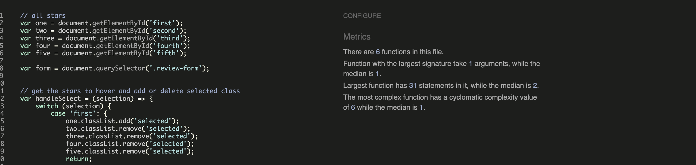
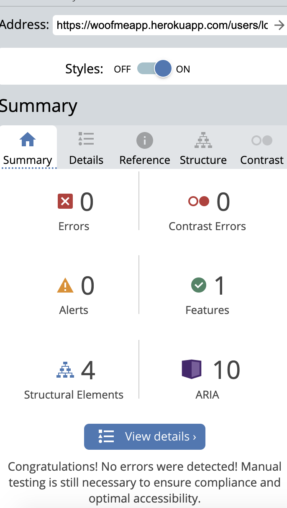

# Testing

During the code development, tests were perfomed to make sure the functions/views/urls are running as expected.

Please see below all tests.

## Code Validation Testing

## Auto-tests

### **WOOFME** 
Manual and automated testing were conducted on woofme app, users app as well as the project urls.

========================================================================================

### **Users App** 
Almost all functions on the users' app were tested automatically using unit tests. Manual testing was performed on the other tests to ensure there are no errors.

* Overall

* Forms

* Views

User Stories covered by tests.

+  "User Story:Account Login/Logout"
+  "User Story:Account Registration"

| test_forms| test_views |  
|    ---    |  ---       |
| SignupFormTest() |  TestRegister() |  
| SignUpFormTestInvalid()|TestLogin()|
||TestLogout()|   | 

========================================================================================

### **woofme_app** 

*  Unittests Overall

* Views 

  * Forms 

 * Urls 

 * Models

 User stories covered by tests: 

+ "User Story: search breed."
+ "User Story : view breeds list."
+ "User Story: add a dog breed + review + image"
+ "User Story: create breed review"
+ "User Story: Open a breed details page."
+ "User Story: See a list of breed groups using a dropdown menu."
+ "User Story: Edit/Delete previously created review."

| test_models| test_views |  test_forms
|    ---    |  ---       | ---
| BreedReviewTestCase() | AddReviewViewTest()  |  CreateBreedFormTest()
| BreedTestCase()      |BreedRatingView()|
| BreedGroupTestCase()  |ReviewPageViewTests()|
|            |EditReviewViewTests()|
|            |SuccessfulEditReviewViewTests()|

Tests covering User Story:

Tests covering User Story :

+ "User Story: Search breed."

| test_views |   
|  ---       |    
| TestSearchBreedView() |  

### **Overall Test on plataform** 

In order to check that I covered all automated tests, I have used coverage tools.See the results below:

+ **woofme**

Overall report for the woofme project.

Uncovered lines in settings file were tested manually. In the woofme/views file, the uncovered lines are those related to error handling pages (400, 404 , 500). They were tested manually with no errors.

+ **woofme_app**

Uncovered lines on woofme app are present only on views file. They are related to DeleteReviewViews and EditReviewViews. Manual tests were performed to ensure no error was detected.

  
+ **users app**

On the users app, there are also some uncovered lines on the views that were tested manually. 

   
   ## Integration Test Case

+ On this project, the Incremental Testing method was used.

 Incremental testing approach was used for this project to find issues at an early stage and solve them. Please find these tests for each feature below.

### **Navbar**

| Test Case Id | Description | Expect result|
|:----:|:----:|:----:|
| 1 | Click Breed Reviews' navbar button| To be directed to the breed Reviews Page|
| 2 | Click Logo navbar button| To be directed to the home Page|
| 3 | Add a breed name (present on DB) on left field and  search | To be directed to the search breed page with a short intro to the review.|
| 4 | Add a breed name (not present on DB) on left field search | To be directed to the search breed page with feedback on lack of reviews and button to add review page.|
| 5 | Click login's navbar button | To be directed to the Login Page|
| 6 | A logged User click logout's navbar button | To be logged out and directed to the Home Page|

### **Login**

| Test Case Id | Description | Expect result|
|:----:|:----:|:----:|
| 1 | Enter login credentials and click on the Login button| To be directed to the home page|
| 2 | Enter wrong redentials and click on the Login button| Error message!|

### **Register**

| Test Case Id | Description | Expect result|
|:----:|:----:|:----:|
| 1 | Enter all register data and click on the Sign In button| To be directed to the home page, displayed a success message and logged in.|
| 2 | Enter invalid register information in any field and click on the Login button| To be given to an error message|

### **Reviews Card**

| Test Case Id | Description | Expect result|
|:----:|:----:|:----:|
| 1 | Click in a breed review card on the review list| To be directed to the breed page view |
| 2 | Click on Edit button present on card| To be redirected to edit review page|
| 3 | Click on Delete button present on card| To be redirected to confirm deletion page|

### **Footer** 

| Test Case Id | Description | Expect result|
|:----:|:----:|:----:|
| 1 | Click on the social media buttons| To be directed to the developer's social media pages. |

### **Buttons**

| Test Case Id | Description | Expect result|
|:----:|:----:|:----:|
| 1 | Click Next pagination button| To be direct to the next review page|
| 2 | Click Last pagination button| To be direct to the last review page|
| 3 | Click First pagination button| To be direct to the first review page|
| 4 | Click Previous pagination button| To be direct to the previous review page|
| 5 | Click Go Back button on edit review page| To be direct to the previous navigated page|
| 5 | Click Back to Reviews button on detail review page| To be direct to the breed reviews navigated page|
| 6 | Click Edit button on edit review page| To be direct to the breed page navigated page and be presented with new updated review|
| 7 | Click on a star in rating breed or update breed page | Populate breed rating field on review form|
| 10 | Click on adaptability/trainability/friendliness/health and grooming needs dropdown button on add breed rate or update breed page | Be presented with all criterias choices (1-5)|
| 12 | Click on browse image button on add breed rate or update breed page | Open your directory to find an image to upload|
| 13 | Check clear on update breed page | Clear image previously uploaded to breed review|
| 14 | Click Review Your breed Now on search breed page| To be direct to the add breed review page|
| 15 | Click on the icon button on the main page| To be direct to the breed reviews list|

## Python (PEP8) Validation

###  **Woofme App** 

        
        
        
        

+ Error in settings file - line too long - link. 

###  **Users App** 

        
        
        
        
        

### **Woofme_app App** 

        
        
        
        
        
        
        
        
        
        

+ line to long errors related to cloudinary links.

## HTML Code Validation

## CSS Code Validation

        

## JavaScript Code Validation

### **add review js** 

        

### **script js** 

        

### **toollip js** 

        

## Exploratory Testing
========================================================================================

### Initial User Testing 

A session was held with an test-user. The feedback obtained is listed below:

1. **Home page**

  1.1 The user required a different background image to have more contrast.
  1.2 The user required a button on home page which redirect to the review list(not only the navbar breed reviews button). This is to increase interaction on the body of the home page.

2. **Navbar** 2.1 The colors on the navbar are not contrasting with the background color of the home page which creates a visual illusion. 

3. **Search breed and review list** 3.1 Too much information on review cards, you can see everything without opening the review page. 

4. **extra tips** 4.1 The user proposed to integrate a search by breed group function to the website. 

### **Response to the user experience test:**

+ All user feedback was taken into account and incorporated except 4.1 as it is planned to be a future feature.

### Final User Testing 

For this test, I have created a checklist for the user which included tests for all features of the pages. Please see the results below: 

[Final user test](media/readme/unittests/user-test.png)  

### **Response to the user test:**

+ All bugs were fixed before submission. 

## Manual Testing
========================================================================================

### Desktop

### Mobile

### WAVE Accesibility validation

**Home page analysis**

        

**Breed Reviews analysis**

        

**Add review Page analysis**

        

**Login Page analysis**

        

**Register Page (with no reviews) analysis**

        

### Lighthouse validation

**Home page Lighthouse analysis**

        

**Breed Reviews Lighthouse analysis**

        

**Add review Page Lighthouse analysis**

        

**Login Page Lighthouse analysis**

        

**Register Page (with no reviews) Lighthouse analysis**

        

# Unfixed bugs

